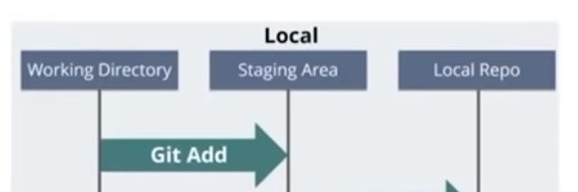
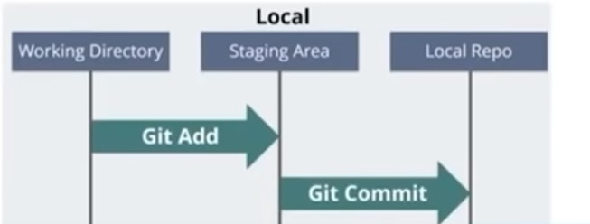
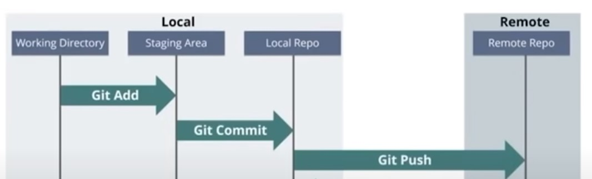
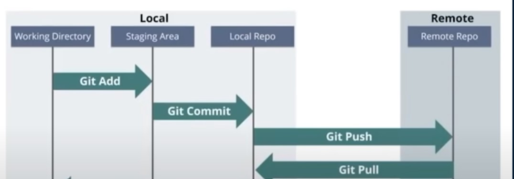
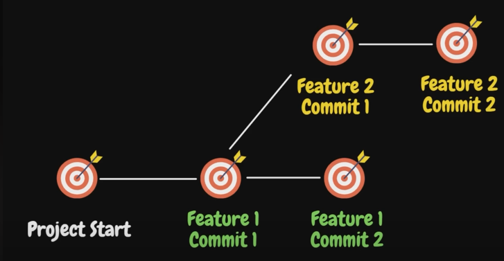
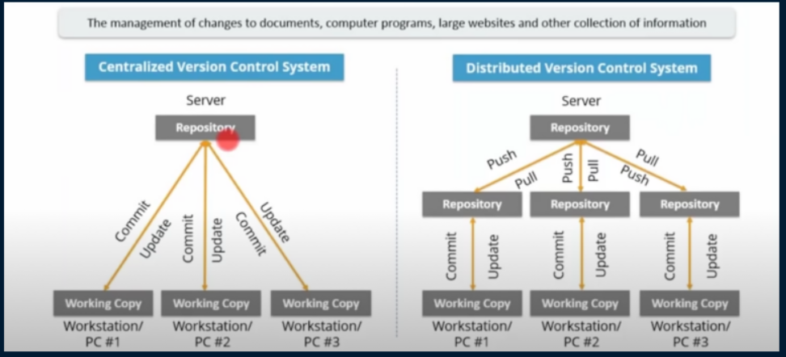

# git-basic-commands
Git Basic Commands

1. **git clone  [git repo link ]** → to clone or copy remote repo to local machine 
>Example : git clone https://github.com/Nax-Ripper/git-basic-commands.git

>  

2. **git add [fileName]** → to tell git those file are need to be tracked
> Example : git add add.py --> to add specific file 

> Example : git add .  --> to add all files in current working dir

> 

3. **git status**  → to see the status of the local repository

4. **git commit -m [message]**  → push code to the local repo
>Example :  git commit -m 'First commit'

> 

5. **git push** → push the files to public/remote repo

> 

6. **git pull** → pull the remote code to local

> 

7. git checkout -b ['new-branch']  → checkout to a new branch

> 

8. git merge <branchName> --> to merge other branch to current branch 

> 

<h3>Distributed vs Centralized Version Control System</h3>

> 